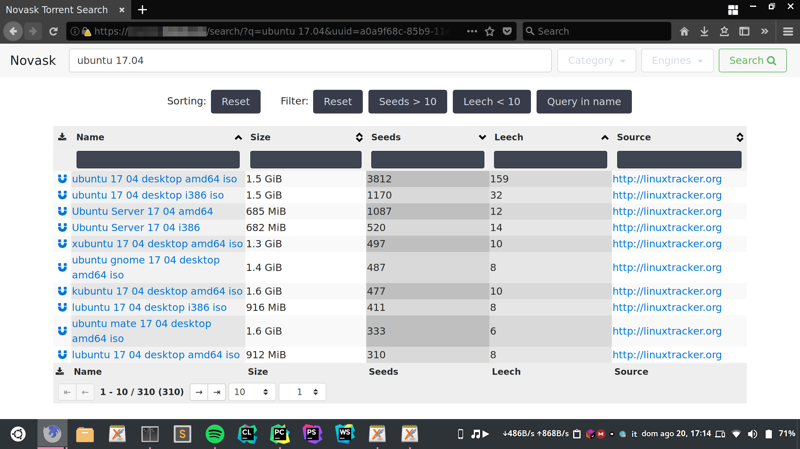

# Novask Torrent Search

A Python3, Flask-based torrent search engine based on qBittorrent's.



#### Important security/legal notes

Search plugins may allow to download content that is illegal in some countries. Novask's developers and contributors discourage this and take absolutely no responsibility for what you do with this program.

Novask allows to download torrents without having to go through the original websites' advertisements, etc.
This may infringe their terms of service. It is your responsibility not to use any search plugins that may cause complaints, etc.

Novask has not been tested for security. As of now, if somebody gets access to your Novask instance, they could easily run a DoS attack on your server as simply as spawning a little too many search jobs. Also, search plugins may not be safe: always read their source code before using them.

You may want to create a separate, restricted user for Novask and use some process management techniques such as process groups to limit such vulnerabilities.

If you install Novask on a publicly accessible web server, always make sure it's password protected so that only **you** can use it.


Table of Contents
=================

   * [Novask Torrent Search](#novask-torrent-search)
      * [Testing](#testing)
      * [Deploying](#deploying)


## Testing

#### Make sure SQLite3 is installed

```sh
sudo apt install sqlite3
```

#### Clone the repository

```sh
git clone https://github.com/Depaulicious/Novask
```

#### Install Novask in development mode
You may need to run `pip3` as root, or use just `pip`. Note that Python2 *should* work but is not supported.

```sh
cd Novask
pip3 install -e .
```

#### Create the search engines directory

```sh
mkdir -p instance/engines
```

#### Download search plugins
Put them in `instance/engines`.

Note that [Nova6](https://github.com/Depaulicious/Nova6) (the back-end) should support both Python2 and Python3 plugins out-of-the-box; however, if there are both Python2 and 3 versions, use the one that matches the version of the interpreter you're planning to run this in.

Some common sources:

- https://github.com/qbittorrent/search-plugins/tree/master/nova3/engines
- https://github.com/qbittorrent/search-plugins/wiki/Unofficial-search-plugins

#### Create testing database

By default, Novask uses an SQLite database at `/tmp/test.db`.

Create it:

```sh
python3 -c "from novask.database import db; db.create_all()"
``` 

#### Run the development server

```sh
export FLASK_APP=novask
export FLASK_DEBUG=true
flask run
```

You should be able to test Novask at [localhost:5000](http://localhost:5000).

## Deploying

- [On Apache](https://github.com/Depaulicious/Novask/wiki/Deploy-with-Apache)